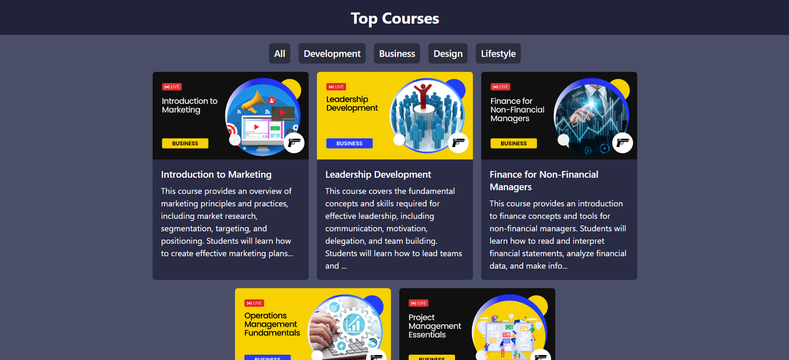

# Courses Catalogue UI

## Overview

The Courses Catalogue UI is a React JS and Tailwind CSS project that presents a user-friendly interface for exploring different courses. Each course is accompanied by a description, an image, and a like button that triggers a toast notification. The project also features category tabs that filter courses based on the selected category. Course data is retrieved through an API call in JSON format.

## Features

- **Course Listing:** Explore various courses with descriptions and images.
- **Like Button:** Click the like button for a course to display a toast indicating whether the course was liked or not.
- **Category Tabs:** Filter courses by selecting different category tabs.

## Technologies Used
- React JS
- Tailwind CSS
- Axios (for making API calls)

## API
The course data is retrieved through an API call. The data is in JSON format.

## Screenshots

